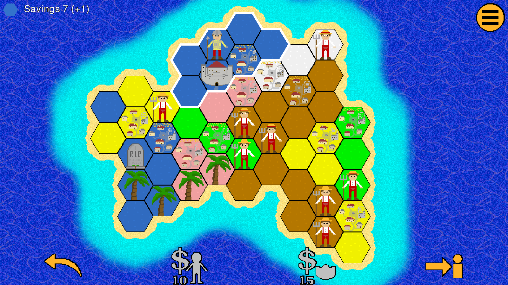

# Feudal Tactics - Medieval Strategy Game

A medieval strategy game with countless unique and challenging levels. You play on an randomly generated island made of hexagons. Your goal is to conquer all of it. To do so, you attack the enemy with your units while trying to protect your own kingdoms. Made with libGDX. The game mechanics are heavily inspired by Sean O'Connor's Slay.

## Roadmap
I would like to implement the following features. It might happen soon, in a few years or never.
- playable tutorial
- sound
- scenario maps
- map editor
- local multiplayer
- online multiplayer

## Licensing

Copyright (C) 2022  Sesu8642

This program is free software: you can redistribute it and/or modify it under the terms of the GNU General Public License as published by the Free Software Foundation, either version 3 of the License, or (at your option) any later version.

This program is distributed in the hope that it will be useful, but WITHOUT ANY WARRANTY; without even the implied warranty of MERCHANTABILITY or FITNESS FOR A PARTICULAR PURPOSE.  See the GNU General Public License for more details.

You should have received a copy of the GNU General Public License along with this program.  If not, see <https://www.gnu.org/licenses/>.

## Licensing of Contributions
Contributions are multi-licensed under __GPL-3.0-or-later or MIT__. See [CLA](CLA.md).

This allows me to potentially release versions that contain propriatary libraries, e.g. for integrating third party multiplayer services or receiving payments. The F-Droid version will never contain any proprietary components, of course.

Why not just license contributions under MIT? All files somebody contributes to would be licensed under GPL-3.0-or-later __and__ MIT. While the MIT license is compatible with the GPL-3.0, it does add the additional requirement to include the MIT license text in the software. This would make it complicated if anyone wanted to use some file in a different project. With the multi-licensing, every file can simply be used under GPL-3.0-or-later.

## Contributing
Before starting any work, please propose your changes in a GitHub issue.

Before a pull request can be accepted, you must sign the [CLA](CLA.md) by adding your name to the table.

## Technical Documentation
Technical documentation is available in the [wiki](../../wiki).

## Privacy
No data is collected at all. See [privacy policy](https://raw.githubusercontent.com/Sesu8642/FeudalTactics/master/privacy_policy.txt). It is based on [the one from the Catima Website](https://github.com/CatimaLoyalty/Website/blob/master/_pages/privacy-policy.md).