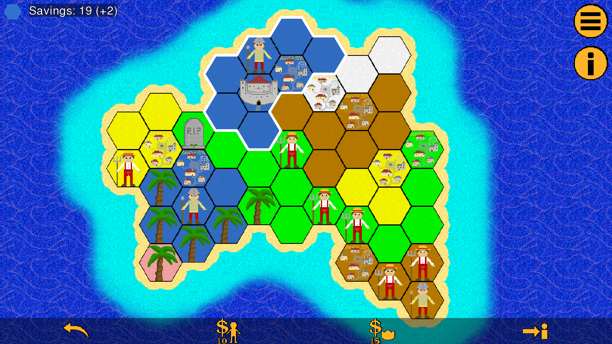

# Feudal Tactics - Medieval Strategy Game

A medieval strategy game with countless unique and challenging levels.

You play on an randomly generated island made of hexagons. Your goal is to conquer all of it. To do so, you attack the enemy with your units while trying to protect your own kingdoms.

The game mechanics are heavily inspired by Sean O'Connor's Slay.

## Licensing

Copyright (C) 2022  Sesu8642

This program is free software: you can redistribute it and/or modify it under the terms of the GNU General Public License as published by the Free Software Foundation, either version 3 of the License, or (at your option) any later version.

This program is distributed in the hope that it will be useful, but WITHOUT ANY WARRANTY; without even the implied warranty of MERCHANTABILITY or FITNESS FOR A PARTICULAR PURPOSE.  See the GNU General Public License for more details.

You should have received a copy of the GNU General Public License along with this program.  If not, see <https://www.gnu.org/licenses/>.

## Privacy

No data is collected at all. See [privacy policy](https://raw.githubusercontent.com/Sesu8642/FeudalTactics/blob/master/privacy_policy.txt). It is based on [the one from the Catima Website](https://github.com/CatimaLoyalty/Website/blob/master/_pages/privacy-policy.md).

## Contributing
If you would like to contribute, please contact me first.